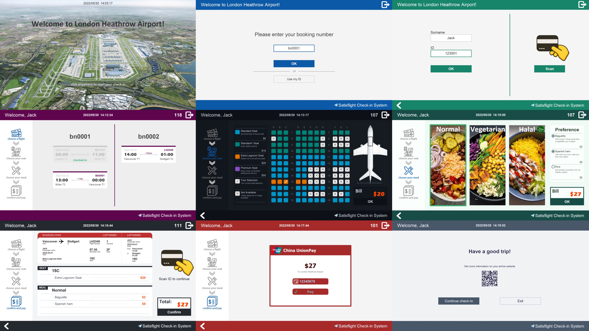

# EBU6304-2021-Software-Engineering-Group-111

---

## Preview | Satisflight v5.0: Oriental

Click to play demo 👇

---

## This branch is the current version of Satisflight Check-in System

**Quick Links:**
- [Group Project Handout](https://qmplus.qmul.ac.uk/mod/resource/view.php?id=1562883)
- [QMplus Hub Guidelines for Group Project](https://qmplus.qmul.ac.uk/mod/resource/view.php?id=1562886)

---

**Group Members**
- Wang Zaitian [*@ZaitianWang*](https://github.com/ZaitianWang)
- Li Chunlin [*@CuSO5*](https://github.com/CuSO5)
- Wang Chenyu [*@wcyfrank*](https://github.com/wcyfrank)
- Ni Ruijie [*@zhuantomato*](https://github.com/zhuantomato)
- Liang Zhehao [*@BHobbes*](https://github.com/BHobbes)
- Zhang Zeyu [*@JerryZhangZZY*](https://github.com/JerryZhangZZY)

---

**Suggested Timeline:**
- 11-15 March: set up the QMPlus Hub group and discuss the project handout.
- 16-18 March: story writing workshop. Outcomes: product backlog and prototype
- 21 March-1 April: Iteration 1. Outcomes: Working Software v1
- 4-15 April: Iteration 2. Outcomes: Working Software v2
- 18-29 April: Iteration 3. Outcomes: Working Software v3.
- 2-13 May: Iteration 4. Outcomes: Working Software v4.
- 16-30 May: Iteration 5. Outcomes: Software final delivery.