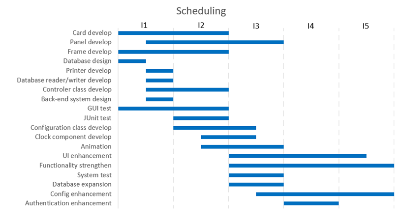
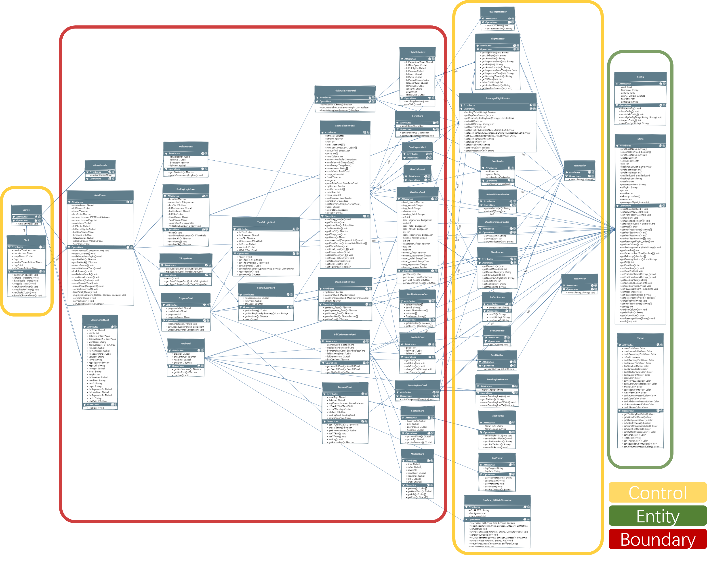
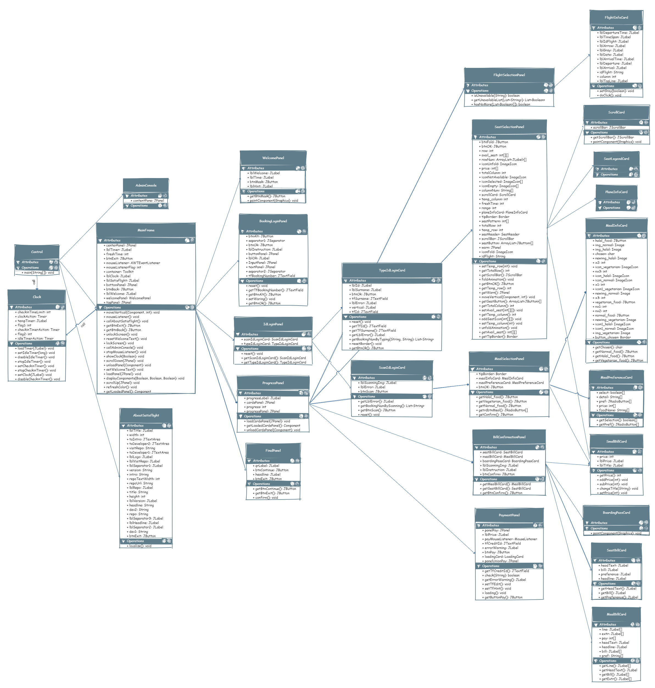
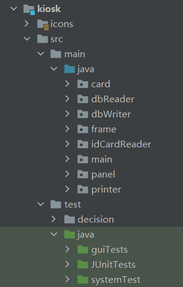
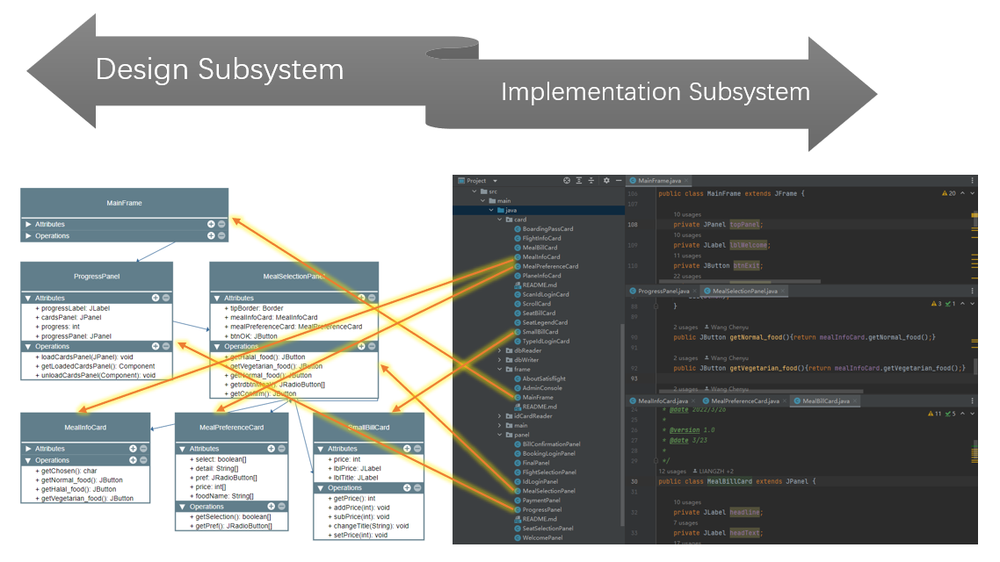
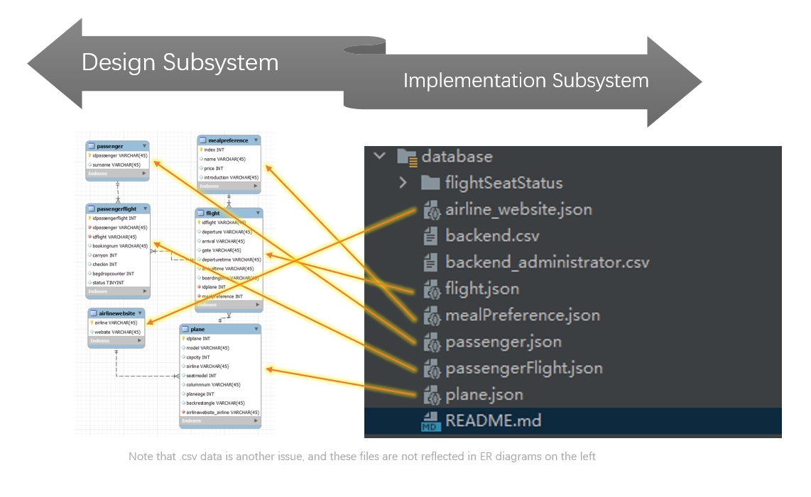
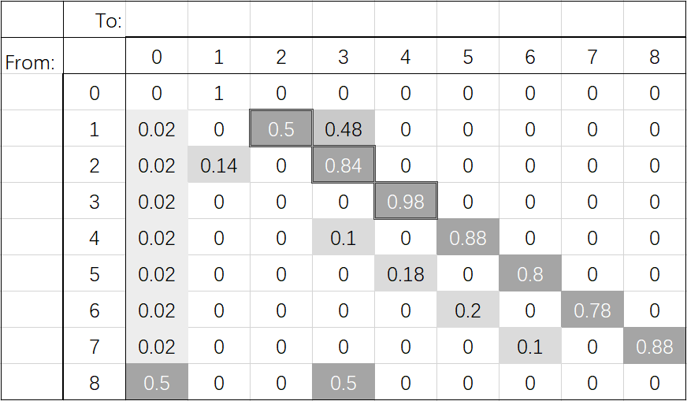
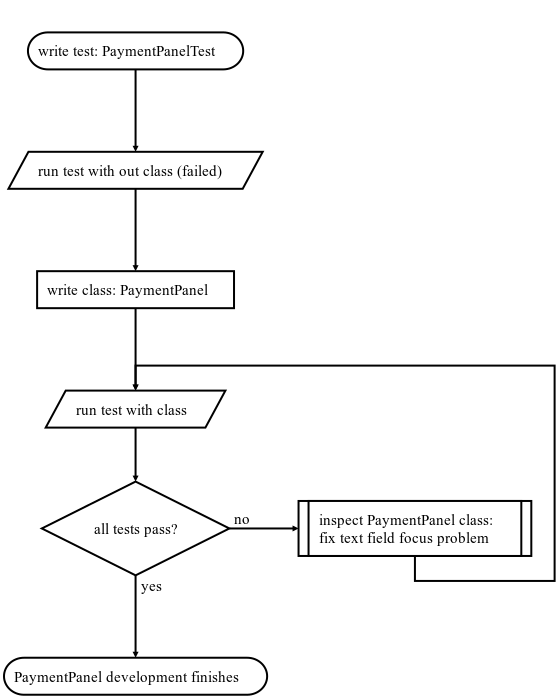

# FINAL REPORT GROUP 111

[TOC]

## Project management

### Development Platform

Our group mainly uses **GitHub** and **Gitee** as the development platform, aiming to facilitate remote collaboration between team members and implement version control.

GitHub's **commit** feature allows team members to upload their code to the cloud repository. Then GitHub **Actions** will check code rationality after we push code. We use GitHub **Issue** to list the tasks that need to be completed during each iteration and limit the completion time through **milestone**. And we use different **branches** to manage project versions and publish them in GitHub **Releases**. Group members’ contributions are all documented in GitHub **Insights**.

In order to facilitate team members with challenged network access to GitHub cloud repository, we configured a **Gitee** repository as the mirror.

### Journal Tools

All code updates are recorded in the **git log**. If there is any problem with the code, the author can be found through the log.

We also use **QMPlus Hub** to keep track of our progress. Development timelines, minutes of meetings, and personal pages record every step of our development.

### Communication tools

We use **QMPlus Hub Forum** to share and exchange views, **Tencent Meeting** to discuss tasks and timetable, and **WeChat** to communicate real-time ideas. GitHub also send **emails** to group members is there is any new issues.

### Scheduling



### Planning

At the beginning of each iteration, we planned iteration goals, formulated and distributed phase tasks through online meetings. We use **milestone** to set the completion time for each task to ensure the progress of the project.

At the end of each iteration, the programmers are given a short vacation so that we can rest and be more productive.

## Requirements

### Requirements finding techniques

In this part, our team adopted a variety of different ways to find public demand.

#### Group meeting 

Our group group meeting every week trying to identify problems in time, our group will be before each iteration for everyone to participate in team meetings for many times, everyone will be put forward at the meeting in the previous iteration to solve the problems by themselves and the newly discovered problems, and through discussion with classmates around looking for other team strength to make up for our team.

#### Questionnaire 

In order to expand the scope of investigation and research, our team chose to fill in questionnaires and expand its influence through the Internet, so that more samples can be obtained. By analyzing a large enough sample, we can study the general functions of software needed by the public.

#### Field research

Our group firmly believes that software development without talking about requirements will never succeed. Therefore, our team members went to the local airport to conduct field research on the domestic aircraft check-in system, and felt the progressiveness and pain points of the real software through personal use. To solve these problems in subsequent iterations, we believe that relying on reality is the mindset of software developers.

#### Website 

In addition to traveling to real airports, the websites of major airlines also provide a lot of inspiration and improvement. These real airlines through years of operation experience summed up the production of check-in system experience let us benefit a lot.

#### New ideas

Our team members have a broad vision. Through the pain points of the flight check-in system we feel in our daily life, we can find the problems existing in our system and solve them. In order to make our system more user-friendly, we also thought of many ways to make customers like it, including the user-friendly dark mode, where everyone can choose to customize their own theme colors. These are our exclusive design functions, through these functions we hope that customers can truly experience the meticulous care of the airline.

### Epics and User stories

Through the above information acquisition approach, we completed the general idea of the software, and then we wrote them as Epic. Our Epic is mainly divided into three parts. From there, we continued to increase requirements and improve the original part, resulting in 44 User Stories. There are almost 10 tasks to complete in each iteration, so our system is pretty good right now.

### Backlog

Once User Stories was built, we had to create a Backlog with a strict hierarchy of priorities and prioritize functionality to meet User needs. In the process of completing software requirements, we often find problems. At this time, we will estimate whether this problem can be completed in this iteration according to the existing time. If not, this problem will be put to be completed in the next iteration.

### Prototype

We'll redraw Prototype as soon as the user interface changes, and we changed the user interface three times as we wrote the program

## Analysis and Design

### Analysis



Here's the UML diagram of the whole software (**BackEndSystem** excluded). The edges contains both "**create**" and "**call**", so it seems a mess. If we remove all "**call**" edges, the software structure turns to be hierarchical.



As you can see, the tree-based structure starts at the **Control** class, where all the page switching happens. It creates a **MainFrame** object which contains top and bottom bar of the software GUI. It also holds different functional **panels** and switches them if being called by the Control class. **Cards** are smaller panels or "sub-panels" , which have different functions respectively. They were added to each panel. So that same function can be **reused** by creating the card object again.

In order to use the database efficiently, we designed several abstract **database reader/writer** classes. So any class can read from or write to the database by simply calling a method from those database readers/writers. The only **non-abstract** reader is **SeatReader**, since only a single seat status file will be visited when a user selecting a seat and will be request at a high frequency. By creating an object, we are able to read in the file only once, improving I/O performance. Details like this can be found everywhere in our code. These data readers/writers also show the high reusability of our program.

Another light spot of our design is the class **State**. It contains all the temporary values during a check-in process and the information is gradually completed through the check-in process. So that latter pages can use the previous information directly instead of accept the parameters pass from the earlier pages. By using State class, we are able to separate panel classes totally, designing a fully-independent, **loosely-coupled** software. 

- [ ] Since user operations on a latter page may afflict the pages before it, we are also able to achieve jumping back and forth freely between pages thanks to this design.

### Design

We have high standards for *Satisflight* check-in system. It has to be easy to use, modular, highly customizable, beautiful-looking as well as error-free.

#### Ease of use

The software has only **one** main **frame** and all function panels are **switched** on it. Each panel only provide small amount of information and has a **clear layout** and **instructions** for guidance if input is wrong or missed. Users can jump **back-and-forth** between pages freely. An **exit** button is always on the top right corner, enable to exit at any time. There is also a **clock** on top to the screen showing the exact local time. Plus, all pages are optimized for **touch** screens and providing visual **feedback** everywhere.

#### Modularity

As shown in the previous section, the software is designed with a **tree** structure. And **State** class enables a independent relationship between classes. So each **card** can be seen as a small **module** and can be added/removed/modified in function **panel** without any restriction. To achieve page switching, the action listener change the value **pc** in **State**, which was detected continuously in **Control** at a frequency of **100Hz**(>60Hz screen fresh rate). So the switching can be handled timely. In this case, we can encapsulate each function module in a panel and easily manage all modules by assigning different **pc** to each of them.

#### Configurability

There are tons of configurations in **config.yaml**, enabling *Satisflight* to suit every airport. For example, you can set check-in leading time so the flight check-in will be unavailable before a period of time, say, stop checking-in 30 minutes before departure. You can find more details in the **user manual**. The software also support any type of **aircraft**. You can use any **seat pattern** and customize aisle positions. Furthermore, airline companies can set their own meal **preferences** as many as they want.

#### Aesthetic

The software has a theme library which has 8 built-in themes in **theme.json**. Airport manager can customize colors in detail by editing the json file.  **Auto dark mode** allows *Satisflight* to switch to a dark theme in the evening. This function can be closed in config. Also, a non-liner **animation** is applied when switching pages or locking screen. The animation speed is also configurable.

#### Robustness

Rigorous **exception handling** is applied to make sure the **stability** of the software which would run continuously for a long time. **Input** values are checked strictly at every step. All operations of **writing** to the database will not be executed until reaching the final page, ensuring the **safety** of data even if the software crashes. The config and theme are well checked before the frame shows. It will generate a default file if the file is missing. If **theme** configuration fails to load, it will use theme "*Cobalt*" and "*Onyx*" as **default**. If any of the **config** load failed, *Satisflight* will **refuse to start** for **safety** reasons.

### Design Principles

- [ ] wz help me : )

## Implementation and Testing

*• Discuss the implementation strategy and iteration/built plan.
• Discuss the test strategy and test techniques you have used in your
testing.
EBU6304 – Software Engineering (2021/22) Page 5 of 7
• Discuss the using of TDD. Note: TDD is not required for developing the
whole software, however, you should try to use TDD to develop a few
programs.*

### Implementation

#### Component Management

The project is relatively big in its size, and thus it is very important to properly managing various components before writing codes. We divide source codes into two separate modules, `back-end-system` and `kiosk`. Other components are organized in `database`, `lib`, `out`, .etc.

For detailed component structure, vide chart below. Component stereotypes are appended behind,

```
├─ back-end-system  <<minor module>>
├─ conf             <<(auto-generated supporting) file>>
├─ database         <<database table>>
├─ docs             <<documents>>
├─ kiosk            <<major module>>
│   ├ icons         <<(supporting) file>>
│   └ src           <<s(ource code) file>>
├─ lib              <<library>>
├─ out              <<executable>>
└─ printer-output   <<software output>>
```

Among all directories, `src` is the core of this project, which contains all the codes of the kiosk programme. With in this directory, we use package to implement subsystems. To be specific, we applied a hierarchical structure to organize classes. We classify boundary classes, or GUI classes into `frame`, `panel`, and `card` (small panel or sub-panel) packages. And control classes to access database are held in `...Reader/Writer` packages. `main` package are for some system-level classes.



#### Traceability

As we know, in the process of implementation, an important principle is to make sure every implementation component traces the corresponding design elements. This requires developers to map carefully design to code.

These figures show how classes and database tables in implementation can be traced back to design stage.





#### Build

##### Build plan

We decided that we create a major build at the end of each iteration by creating a new version Release in GitHub. Before each iteration, we held a group meeting to discuss the functionalities to be implemented in this build. And when we release a new build, we always write a release note to elaborate new features and using instructions. If any fatal errors are discovered after we made x.0 release, we will release x.1 with hotfix in no time to make sure latest release work properly.

##### Version control

When each build is finished, we create a new branch to. Old versions are always kept in those slave branches, while the master branch is under active development and is up-to-date. 

Apart from major and minor builds, there are also many "micro" builds, i.e. commits. On finishing a part of development, we commit and push our changes, uploading the new files to GitHub repo and merging them with branches from other developers local repo. All actions are saved in git log. This makes sure that even the smallest changes are independently recorded in our version control system. If anything goes wrong, we can easily identify the defect, the author who cause it, and the timestamp when the erroneous commit is made. A simple revert can fix anything.

#### Elegance of Code (?)

- [ ] maybe

### Testing

#### Testing Overview

The basic testing mechanism is as following: 

1. Using methods like `JTextField.setText()`, `JButton.doClick()` to manipulate software GUI, simulating user operation, and injecting data into database.
2. Retrieving data from database using `XXReader.getXX()` to get the result of an operation,
3. Comparing expected value with actual value using `Assertions.assertEqual()`, checking if actions indeed lead to changes in database, which means a passenger have successfully checked-in (or succeeded in a step of check-in process. 

Our testing consists of three parts: GUI Test, unit test, and system test.

#### GUI Testing

When designing the GUI, we carefully tested each component. Every GUI class is accompanied by a test class that creates an instance of this GUI class, so that we could see what our design looks and make sure interactive components work in good manners before the whole interface is assembled.

#### Unit Testing

We apply `JUnit 5.7.0` library to implement test programmes. Depending on the complexity, a testing class is design for a panel or a card(sub-panel). There are also unit testing classes for database reader classes. Test programmes contain several subtests that independently check different functionalities of classes. 

For instance, in testing class `BookingLogingPanelTest`, there are three tests:
```java
void testBookingLoginPanel();
void testAlternativeCheckIn();
void testExit();
```
They respectively test if the panel can properly log in by entering booking number, moving to another page that use ID to log in, and exit the log in process. If all three tests pass, the test class passes. In order to eliminate uncertainty, we use `@RepeatedTest(int)` to run each test multiple times. 

#### System Testing

To verify that the programme works as a whole, we also implemented system testing, aka integrated testing. In order to simplify the operation of testers and reduce workload, we utilized unit testing classes mentioned in the last section. Note that integrated test is not simply running all unit tests in sequence. Instead, it uses a delicate mechanism, **stochastic process**, to perform the check-in operation in real-life.

Operation on each page of the software is considered as a "state", and a user has certain probability to transfer from this state to another, namely turning to next page, go back to last page, or exit to the starting page. This kind of stochastic process is called Markov process. We designed a **Markov matrix** to simulate the possibility of users' operation at each page. The system testing class will toll a die before going to another page. The point of the die is compared with the Markov matrix, and based on the result, the class turn to a certain page, namely, running the test method of a certain unit test class.

The figure below illustrate the markov matrix we use. 



To utilize this transition matrix, we developed a Markov class to decide the next page to be tested.

```java
public class Markov extends CsvReader {
//    ...
  public int nextStateOf(int current){
//    ...
  }
}
```

We designed this algorithm to **simulate uncertainty when users are using the software**. In some cases, the testing programme moves to and fro for many times. This, in fact, is quite common: we are sometimes afraid of making wrong operation, so we keep turning to early pages to check the seat or meal we've chosen is indeed what we want. The software, for example must make sure no matter how we switch page, no error display happens.

#### Test Case Design

The disciplined technique used in test case design is partition testing. Take class `TypeIdLoginCardTest` for example. Here we test if the panel where passengers enter their name and ID number to check in is working properly. Input data fall into the following classes:

1. valid input with non-zero flights
2. valid input without flights to check in
3. valid in terms of format but contents do not match
4. invalid even in format

Specific test cases chosen from these partitions are as below:

```java
String[] candidateName = {"Jack", "Mike", "Amy", "Karl", "Amy", "nay"}; 
String[] candidateID = {"123001", "123002", "123003","123003", "123006", "nil"};
String[] expectedBookingNum = {"bn0001", "bn0003", null, null, null, null};
```

Only the two test cases from partition 1 will return valid booking number results.

#### The Use of TDD

We started to learn this topic long after we had finished most parts of the project, so only a few classes is designed. The flow show an example of using TDD to develop GUI classes.



## Appendix

### JDK
https://docs.oracle.com/en/java/javase/15/docs/api/index.html
### JUnit
https://junit.org/junit5/docs/current/user-guide/#writing-tests-annotations
### Fastjson
https://mvnrepository.com/artifact/com.alibaba/fastjson/1.2.17
### JavaScv API
http://javacsv.sourceforge.net/
### SnakeYAML
https://bitbucket.org/snakeyaml/snakeyaml/wiki/Documentation#markdown-header-snakeyaml-documentation

### Main screenshots of the system should be included in the appendix.

### And a List of All Issues?
