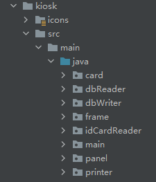
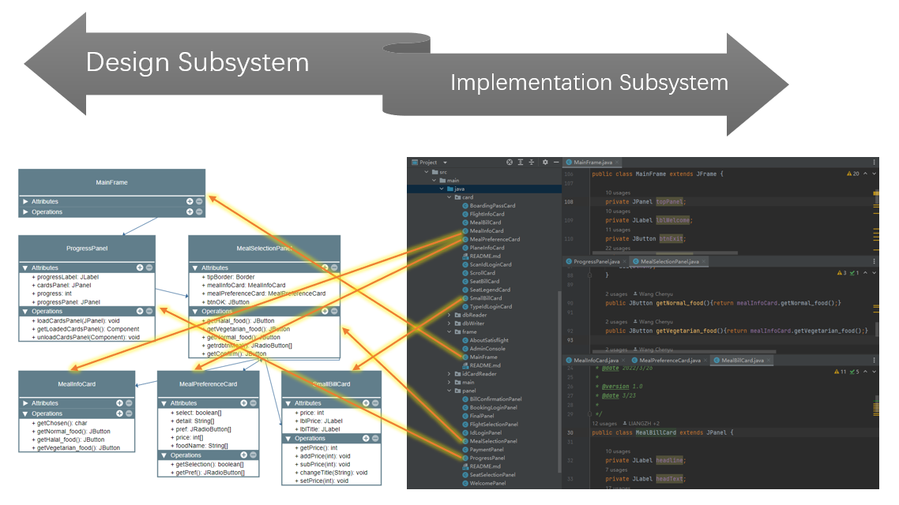
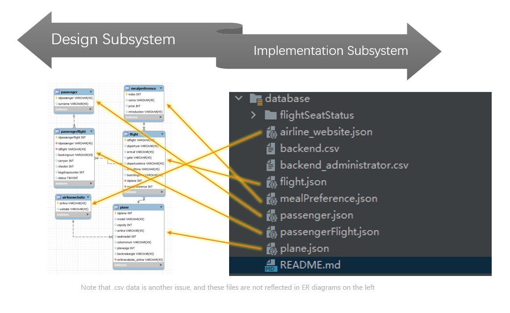

# FINAL REPORT GROUP 111

[TOC]

## Project management

### Version control/develop platform:

Our group mainly uses GitHub and Gitee as the version control/develop platform, aiming to facilitate remote collaboration between team members.
GitHub's commit feature allows team members to upload their code to the cloud repository. Then GitHub Actions will check code rationality after we push code. We use GitHub Issue to list the tasks that need to be completed during each iteration and limit the completion time through milestone. And we use different branches to manage project versions and publish them in GitHub Releases. Group members’ contributions are all documented in GitHub Insights.
In order to facilitate team members with limited network access to connect the cloud repository, we configured GitHub repository mirror on Gitee platform.

### Journal tools:

All code updates are recorded in the GitHub log. If there is a problem with the code, the person in charge can be found through the log.
The QMPlus Hub keeps track of our application development timelines, team meetings, and personal progress.

### Communication tools:

We use QMPlus Hub Forum to share and exchange views, Tencent Meeting for online meetings, and WeChat for private communication and group message notification. GitHub updates are also emailed to group members.

### Scheduling:
  

### Planning:

At the beginning of each iteration, we planned iteration goals, formulated and distributed phase tasks through online meetings. We use milestone to set the completion time for each task to ensure the progress of the project.
At the end of each iteration, the programmers are given a short vacation so that we can rest and be more productive.


## Requirements

*• Apply the requirements finding techniques.
• User stories, including estimation and prioritise of user stories.
• Iterations planning.
• Prototype.
• Adapt to changes.*

- requirements findingg
  - held meeting before each iteration
    - source of idea
      - questionire
      - go to real airport
      - website
      - our new idea
    - epics
  - write stories
  - backlog
- estimating
  - new issues, now or delay
- prototyping

## Analysis and Design

*• A set of design class diagrams describing the design of the software, show
the class relationships. Note that your design should address the issue of
reusability of software components. You should provide clear justification
for your proposed approach and show that your design is adaptable to
change where necessary.
• Discuss the design of the software.
• Discuss the extent to which your design and the code that implements it
meets the main design principles of programming.*

- analysis
  - class sterotypes
  - association
- design
  - modular
  - coupling

## Implementation and Testing

*• Discuss the implementation strategy and iteration/built plan.
• Discuss the test strategy and test techniques you have used in your
testing.
EBU6304 – Software Engineering (2021/22) Page 5 of 7
• Discuss the using of TDD. Note: TDD is not required for developing the
whole software, however, you should try to use TDD to develop a few
programs.*

### Implementation

#### Component Management

The project is relatively big in its size, and thus it is very important to properly managing various components before writing codes. We divide source codes into two separate modules, `back-end-system` and `kiosk`. Other components are organized in `database`, `lib`, `out`, .etc.

For detailed component structure, vide chart below. Component stereotypes are appended behind,

```
├─ back-end-system  <<minor module>>
├─ conf             <<(auto-generated supporting) file>>
├─ database         <<database table>>
├─ docs             <<documents>>
├─ kiosk            <<major module>>
│   ├ icons         <<(supporting) file>>
│   └ src           <<s(ource code) file>>
├─ lib              <<library>>
├─ out              <<executable>>
└─ printer-output   <<software output>>
```

Among all directories, `src` is the core of this project, which contains all the codes of the kiosk programme. With in this directory, we use package to implement subsystems. To be specific, we applied a hierarchical structure to organize classes. We classify boundary classes, or GUI classes into `frame`, `panel`, and `card` (small panel or sub-panel) packages. And control classes to access database are held in `...Reader/Writer` packages. `main` package are for some system-level classes.



#### Traceability

As we know, in the process of implementation, an important principle is to make sure every implementation component traces the corresponding design elements. This requires developers to map carefully design to code.

These figures show how classes and database tables in implementation can be traced back to design stage.





#### Build

##### Build plan

We decided that we create a major build at the end of each iteration by creating a new version Release in GitHub. Before each iteration, we held a group meeting to discuss the functionalities to be implemented in this build. And when we release a new build, we always write a release note to elaborate new features and using instructions. If any fatal errors are discovered after we made x.0 release, we will release x.1 with hotfix in no time to make sure latest release work properly.

##### Version control

When each build is finished, we create a new branch to. Old versions are always kept in those slave branches, while the master branch is under active development and is up-to-date. 

Apart from major and minor builds, there are also many "micro" builds, i.e. commits. On finishing a part of development, we commit and push our changes, uploading the new files to GitHub repo and merging them with branches from other developers local repo. All actions are saved in git log. This makes sure that even the smallest changes are independently recorded in our version control system. If anything goes wrong, we can easily identify the defect, the author who cause it, and the timestamp when the erroneous commit is made. A simple revert can fix anything.

#### Elegance of Code (?)

- [ ] maybe

### Testing

 - from design
 - build/commit
 - iteration/branch
 - testing
   - unit
   - system

## Appendix

### All reports should include a list of references in the appendix.

- jdk
- junit
- qr code
- csv/json/yaml

### Main screenshots of the system should be included in the appendix.