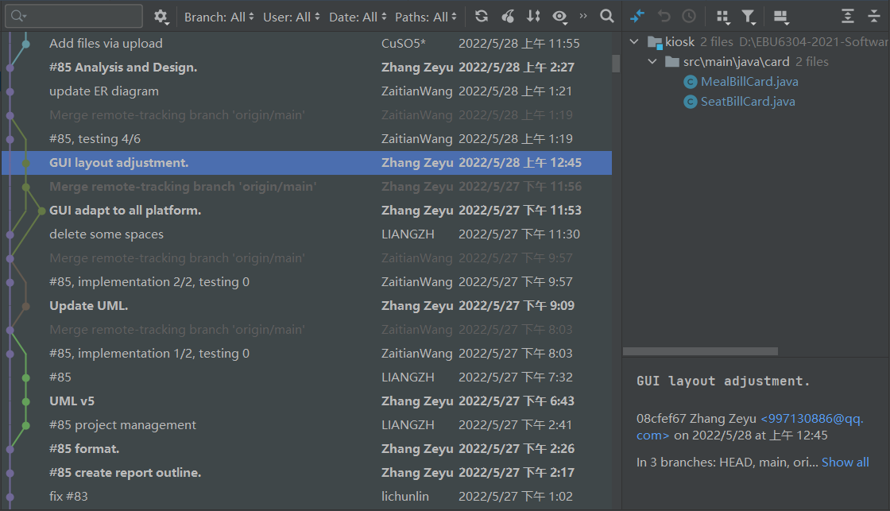
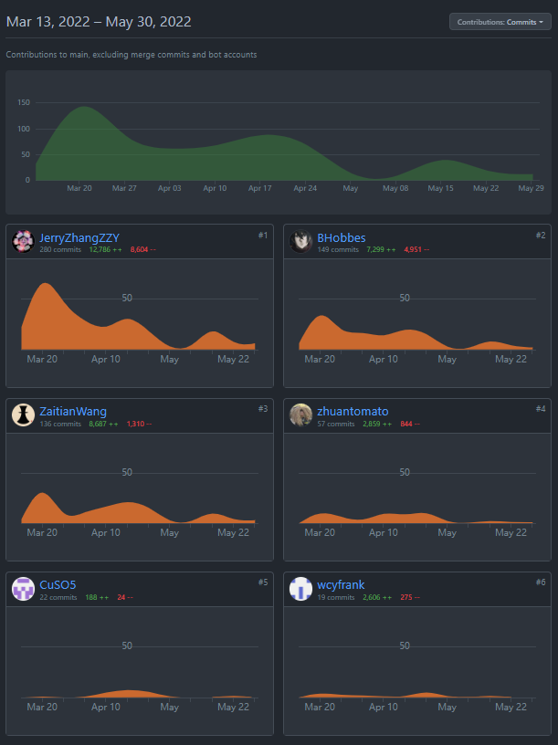

# FINAL REPORT - GROUP 111

## Catalogue

[TOC]


## Project Setup

### Software Type

The software will be a **stand-alone application**, so there is no need to connect to the Internet or communicate with other machines. In addition, this feature makes sure that check-in process is free from race condition.

As required, the software is designed for BRITISH AIRWAYS and London Heathrow Airport, which means it should be a custom software. However, we decided that it will be more **productive** to develop a **generic software**. Through simple configuration, the software can adapt to any airport and various airlines, including Heathrow and BRITISH AIRWAYS. This also facilitates **customization** for other airlines, which is another requirement, and makes the software more **flexible** and **extensible**.

### Software Process

In order to deliver and evolve working software quickly to meet changing requirements, we use **agile process** to develop this project. Details of our agile process is elaborated in later sections.

## Project Management

### Development Platform

Our group mainly uses **GitHub** and **Gitee** as the development platform, aiming to facilitate remote collaboration between team members and implement version control.

GitHub's **commit** feature allows team members to upload their code to the cloud repository. Then GitHub **Actions** will check code rationality after we push code. We use GitHub **Issues** to list and categorize the tasks that need to be completed during each iteration and assign them to team members. GitHub issue is directly related to the story backlog so that our progress can be visually shown. **Milestones** are used to limit the completion time of each task. And we use different **branches** to manage project versions and publish them in GitHub **Releases**. Group members’ code contributions are all documented in GitHub **Insights**.

In order to facilitate team members with challenging network access to GitHub cloud repository, we configured a **Gitee** repository as the mirror, which is real-time **synchronized** with the master repo.

### Journal Tools

All code updates are recorded in the **git log** in units of **commit**. If there is any problem with the code, the author can be found through the log.



We also use **QMPlus Hub** to keep track of our progress. Development timelines, minutes of meetings, and personal pages record every step of our development.

### Communication tools

We use **QMPlus Hub Forum** to share and exchange views, **Tencent Meeting** to discuss tasks and timetable, and **WeChat** to communicate real-time ideas. GitHub also send **emails** to group members is there is any new issues.

### Scheduling


### Planning

At the beginning of each iteration, we planned iteration goals, formulated and distributed phase tasks through online meetings. We use **milestone** to set the completion time for each task to ensure the progress of the project.

At the end of each iteration, the programmers are given a short vacation so that we can rest and be more productive.

## Requirements

### Stories Writing Workshop

Before each iteration, we hold a **group meeting** to discuss new requirements. Everyone put forward the new features and improvements. Then we write **story** cards, which is later collected by a group member and compiled into product **backlog**. 

### Requirements Finding Techniques

#### Questionnaire 

In order to understand public demand, our team used **questionnaires** to collect peoples' opinions. Based on the results, we concluded many important functions to implement.

#### Observation - Field Research

Before starting to write epics, one of our team members went to a local airport to conduct **field research** on the domestic aircraft check-in system, and analysed pros and cons of those check-in kiosks. These findings helped us come up with useful ideas. 

#### Observation - Website 

**Websites** of major airlines or airports also provides us with a lot of inspiration. These real-life products worked as major reference when we were designing the GUI.

#### Original Ideas

Our team is highly imaginative. We came up with many original ideas. For example, we enable users to use **auto dark mode**, which makes the screen more eye-friendly at night. This feature has never been used in any check-in kiosk software.

### Epics and User stories

In Agile process, user requirements are expressed as user stories. Through the above requirement finding methods, we completed the general idea of the software, and compiled it in **Epics**. Because an epic is generally too large for an agile team to complete in one iteration, it is split into multiple smaller user **stories** before it is worked on. We have been adding new stories since the very start of our project, resulting in 44 user stories. We write each user stories as a story cards and discuss them in the group meetings, which is crucial in our agile process. There are about 10 tasks to complete in each iteration.

### Metrics

When writing stories, we used specific measures to make sure that these requirements can be tested. Here are some examples.

- story 3.4 - The time before returning to welcome page is specified as **120 seconds**. It is not vaguely "for some time".
- story 4.2 - We made it clear that, only **8 digits** is accepted, instead of simply saying "certain length".

### Product Backlog

Once the user story is built, we create a **backlog** to record all the stories and the date when we start or complete the implementation of each requirement. 

If we come up with new ideas in the middle of an iteration, we estimate the time need to do it. If a new requirement takes too long, we keep it to the next iteration to make sure all tasks in one iteration can be finished in time. 


### Prototype

Before writing GUI classes codes, we first draw a **sketch** that specifies layout and outlines component of each page. We use low-fidelity prototyping in this step, so it is quick and effective. When GUI design changes, we make an **amendment** to previous prototypes. There are three versions in total. 

## Analysis & Design

### Analysis


Here's the UML diagram of the whole software (**BackEndSystem** excluded). The edges contains both "**create**" and "**call**", so it seems a mess. If we remove all "**call**" edges, the software structure turns to be hierarchical.


As you can see, the tree-based structure starts at the **Control** class, where all the page switching happens. It creates a **MainFrame** object which contains top and bottom bar of the software GUI. It also holds different functional **panels** and switches them if being called by the Control class. **Cards** are smaller panels or "sub-panels" , which have different functions respectively. They were added to each panel. So that same function can be **reused** by creating the card object again.

In order to use the database efficiently, we designed several abstract **database reader/writer** classes. So any class can read from or write to the database by simply calling a method from those database readers/writers. The only **non-abstract** reader is **SeatReader**, since only a single seat status file will be visited when a user selecting a seat and will be request at a high frequency. By creating an object, we are able to read in the file only once, improving I/O performance. Details like this can be found everywhere in our code. These data readers/writers also show the high reusability of our program.

Another light spot of our design is the class **State**. It contains all the temporary values during a check-in process and the information is gradually completed through the check-in process. So that latter pages can use the previous information directly instead of accept the parameters pass from the earlier pages. By using State class, we are able to separate panel classes totally, designing a fully-independent, **loosely-coupled** software. 

### Design

We have **high standards** for *Satisflight* check-in system. It has to be easy to use, modular, highly customizable, beautiful-looking as well as error-free. We also strictly follow the basic **design principles** to maintain the quality of code as its complexity grows with the development.

#### Ease of use

The software has only **one** main **frame** and all function panels are **switched** on it. Each panel only provide small amount of information and has a **clear layout** and **instructions** for guidance if input is wrong or missed. Users can jump **back-and-forth** between pages freely. An **exit** button is always in the top right corner, enable to exit at any time. There is also a **clock** on top to the screen showing the exact local time. Plus, all pages are optimized for **touch** screens and providing visual **feedback** everywhere.

#### Modularity

As shown in the previous section, the software is designed with a **tree** structure. And **State** class enables a independent relationship between classes. So each **card** can be seen as a small **module** and can be added/removed/modified in function **panel** without any restriction. To achieve page switching, the action listener change the value **pc** in **State**, which was detected continuously in **Control** at a frequency of **100Hz**(>60Hz screen fresh rate). So the switching can be handled timely. In this case, we can encapsulate each function module in a panel and easily manage all modules by assigning different **pc** to each of them.

#### Configurability

There are tons of configurations in **config.yaml**, enabling *Satisflight* to suit every airport. For example, you can set check-in leading time so the flight check-in will be unavailable before a period of time, say, stop checking-in 30 minutes before departure. You can find more details in the **user manual**. The software also support any type of **aircraft**. You can use any **seat pattern** and customize aisle positions. Furthermore, airline companies can set their own meal **preferences** as many as they want.

#### Aesthetic

The software has a theme library which has 8 built-in themes in **theme.json**. Airport manager can customize colors in detail by editing the json file.  **Auto dark mode** allows *Satisflight* to switch to a dark theme in the evening. This function can be closed in config. Also, a non-liner **animation** is applied when switching pages or locking screen. The animation speed is also configurable.

#### Robustness

Rigorous **exception handling** is applied to make sure the **stability** of the software which would run continuously for a long time. **Input** values are checked strictly at every step. All operations of **writing** to the database will not be executed until reaching the final page, ensuring the **safety** of data even if the software crashes. The config and theme are well checked before the frame shows. It will generate a default file if the file is missing. If **theme** configuration fails to load, it will use theme "*Cobalt*" and "*Onyx*" as **default**. If any of the **config** load failed, *Satisflight* will **refuse to start** for **safety** reasons.

## Implementation & Testing

### Implementation

#### Component Management

The project is relatively **big** in its size, and thus it is very important to properly managing various components before writing codes. We divide source codes into two separate modules, `back-end-system` and `kiosk`. Other components are organized in `database`, `lib`, `out`, etc.

For detailed component structure, vide chart below. Component stereotypes are appended behind,

```
├─ back-end-system  <<minor module>>
├─ conf             <<(auto-generated supporting) file>>
├─ database         <<database table>>
├─ docs             <<documents>>
├─ kiosk            <<major module>>
│   ├ icons         <<(supporting) file>>
│   └ src           <<s(ource code) file>>
├─ lib              <<library>>
├─ out              <<executable>>
└─ printer-output   <<software output>>
```

Among all directories, `src` is the core of this project, which contains all the codes of the kiosk programme. With in this directory, we use package to implement subsystems. To be specific, we applied a **hierarchical** structure to organize classes. We classify boundary classes, or GUI classes into `frame`, `panel`, and `card` (small panel or sub-panel) packages. And control classes to access database are held in `...Reader/Writer` packages. `main` package are for some system-level classes.


#### Traceability

As we know, in the process of implementation, an important principle is to make sure every implementation component traces the corresponding design elements. This requires developers to map carefully design to code.

These figures show how classes and database tables in implementation can be traced back to design stage.


#### Build

##### Build plan

We decided that we create a major build at the end of each iteration by creating a new version **release** in **GitHub**. Before each iteration, we held a group meeting to discuss the functionalities to be implemented in this build. And when we release a new build, we always write a **release note** to elaborate new features and using instructions. If any fatal errors are discovered after we made x.0 release, we will release x.1 with **hotfix** in no time to make sure latest release work properly.

##### Version control

When each build is finished, we create a new **branch**. Old versions are always kept in those slave branches, while the master branch is under active development and is up-to-date. 

Apart from major and minor builds, there are also many "micro" builds, i.e. **commits**. On finishing a part of development, we commit and push our changes, uploading the new files to **GitHub** repo and merging them with branches from other developers local repo. All actions are saved in **git log**. This makes sure that even the smallest changes are independently recorded in our version control system. If anything goes wrong, we can easily identify the defect, the author who cause it, and the timestamp when the erroneous commit is made. A simple revert can fix anything.

### Testing

#### Testing Overview

The basic testing mechanism is as following: 

1. Using methods like `JTextField.setText()`, `JButton.doClick()` to manipulate software GUI, simulating user operation, and injecting data into database.
2. Retrieving data from database using `XXReader.getXX()` to get the result of an operation,
3. Comparing expected value with actual value using `Assertions.assertEqual()`, checking if actions indeed lead to changes in database, which means a passenger have successfully checked-in (or succeeded in a step of check-in process. 

Our testing consists of three parts: GUI Test, unit test, and system test.

#### GUI Testing

When designing the GUI, we carefully tested each component. Every GUI class is accompanied by a test class that creates an instance of this GUI class, so that we could see what our design looks and make sure interactive components work in good manners before the whole interface is assembled.

#### Unit Testing

We apply `JUnit 5.7.0` library to implement test programmes. Depending on the complexity, a testing class is design for a panel or a card(sub-panel). There are also unit testing classes for database reader classes. Test programmes contain several subtests that independently check different functionalities of classes. 

For instance, in testing class `BookingLogingPanelTest`, there are three tests:
```java
void testBookingLoginPanel();
void testAlternativeCheckIn();
void testExit();
```
They respectively test if the panel can properly log in by entering booking number, moving to another page that use ID to log in, and exit the log in process. If all three tests pass, the test class passes. In order to eliminate uncertainty, we use `@RepeatedTest(int)` to run each test multiple times. 

#### System Testing

To verify that the programme works as a whole, we also implemented system testing, aka integrated testing. In order to simplify the operation of testers and reduce workload, we utilized unit testing classes mentioned in the last section. Note that integrated test is not simply running all unit tests in sequence. Instead, it uses a delicate mechanism, **stochastic process**, to perform the check-in operation in real-life.

Operation on each page of the software is considered as a "state", and a user has certain probability to transfer from this state to another, namely turning to next page, go back to last page, or exit to the starting page. This kind of stochastic process is called Markov process. We designed a **Markov matrix** to simulate the possibility of users' operation at each page. The system testing class will toll a die before going to another page. The point of the die is compared with the Markov matrix, and based on the result, the class turn to a certain page, namely, running the test method of a certain unit test class.

The figure below illustrate the markov matrix we use. 


To utilize this transition matrix, we developed a Markov class to decide the next page to be tested.

```java
public class Markov extends CsvReader {
//    ...
  public int nextStateOf(int current){
//    ...
  }
}
```

We designed this algorithm to **simulate uncertainty when users are using the software**. In some cases, the testing programme moves to and fro for many times. This, in fact, is quite common: we are sometimes afraid of making wrong operation. So we keep turning to early pages to check the seat or meal we've chosen is indeed what we want. The software, for example, must make sure no matter how we switch page, no error display happens. 

By ensuring that all critical modules are executed and all independent paths are tested, this system test can be considered as using **white-box testing**.

#### Test Case Design

The disciplined technique used in test case design is **partition testing**. Take class `TypeIdLoginCardTest` for example. Here we test if the panel where passengers enter their name and ID number to check in is working properly. Input data fall into the following classes:

1. valid input with non-zero flights
2. valid input without flights to check in
3. valid in terms of format but contents do not match
4. invalid even in format

Specific test cases chosen from these partitions are as below:

```java
String[] candidateName = {"Jack", "Mike", "Amy", "Karl", "Amy", "nay"}; 
String[] candidateID = {"123001", "123002", "123003","123003", "123006", "nil"};
String[] expectedBookingNum = {"bn0001", "bn0003", null, null, null, null};
```

Only the two test cases from partition 1 will return valid booking number results.

#### The Use of TDD

We started to learn this topic long after we had finished most parts of the project, so only a few classes is designed. The flow show an example of using TDD to develop GUI classes.


## Conclusion & Outlook

This group project is not only a good practice for our software engineering study, but also a rehearsal for real projects we may encounter in future work. Our insight into software engineering has been greatly gained during this project. But there are a few shortcomings that need to be mentioned.

Firstly, we did not use TDD at the beginning of the project (Iteration 1), causing a series of problems. But since iteration 2, we have implemented TDD rigorously and taken full advantage of it.

Secondly, although basically following the best practice, some user stories are not written quantitatively, making them difficult to verify. Take story 2.5 as an example: we mentioned the need for animation to be smooth "like silky chocolate", which is unclear about how it should be exactly (for example, how many frames per second).

Thirdly, in code design, generalization is not particularly good. For example, many buttons have the same functionality and can be optimized by inheritance. But because we didn't take this into account early on, the code became a little redundant in a few classes.

These problems we encountered are also great harvest the group project brought to us. And we believe that they can be properly solved in future iterations.

## Appendix

### Main screenshots

> In the screenshots displayed here, each page demonstrates a style in our theme library. All pages are consistent in theme color in one run.


### Reference

|   Name    | Version | Website                                                        |
|:---------:|:-------:|----------------------------------------------------------------|
|    JDK    | 15.0.2  | https://docs.oracle.com/en/java/javase/15/docs/api/index.html  |
|   JUnit   |  5.7.0  | https://junit.org/junit5/docs/current/user-guide               |
| Fastjson  | 1.2.17  | https://mvnrepository.com/artifact/com.alibaba/fastjson/1.2.17 |
|  JavaCsv  |   2.0   | http://javacsv.sourceforge.net                                 |
| SnakeYAML |  1.30   | https://bitbucket.org/snakeyaml/snakeyaml/wiki/Documentation   |
| Heathrow  |    -    | https://www.heathrow.com                                       |
|   Ctrip   |    -    | https://flights.ctrip.com                                      |

### Code Contribution

**Group Members**

- Zhang Zeyu [*@JerryZhangZZY*](https://github.com/JerryZhangZZY)
- Wang Zaitian [*@ZaitianWang*](https://github.com/ZaitianWang)
- Liang Zhehao [*@BHobbes*](https://github.com/BHobbes)
- Ni Ruijie [*@zhuantomato*](https://github.com/zhuantomato)
- Wang Chenyu [*@wcyfrank*](https://github.com/wcyfrank)
- Li Chunlin [*@CuSO5*](https://github.com/CuSO5)

